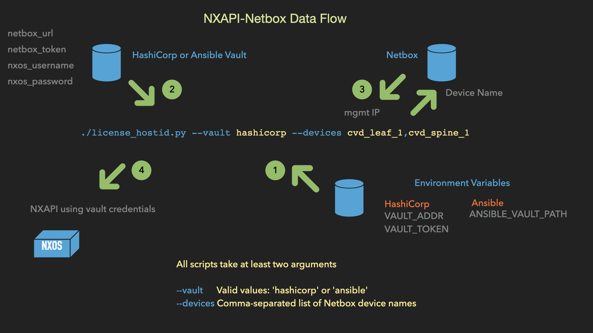

## nxapi-netbox

This repo contains scripts and libraries to interact with Cisco NX-OS switches over NXAPI.



We'll be adding more scripts and libraries over the next week or so (as of 2022-10-14) as we sanitize an internal cache of about 90 scripts and 50 libraries.

Script                                       | Description
------------                                 | -----------
[arp_summary]                                | NXAPI: display ip arp summary
[bfd_neighbor_info]                          | NXAPI: display bfd neighbors detail information
[bfd_neighbor_state]                         | NXAPI: display bfd neighbor state for all neighbors
[bgp_neighbor_l2vpn_evpn_prefix_received]    | NXAPI: display bgp l2vpn evpn summary info
[bgp_neighbor_prefix_received]               | NXAPI: display bgp neighbor summary info
[bgp_neighbor_state]                         | NXAPI: display bgp neighbor state for all neighbors
[bgp_neighbors]                              | NXAPI: display detailed bgp neighbor information
[forwarding_consistency]                     | NXAPI: start and display results for forwarding consistency checker
[forwarding_route_ipv4]                      | NXAPI: Display ipv4 prefix information from FIB related to --module --vrf --prefix
[forwarding_route_summary_ipv4]              | NXAPI: display forwarding ipv4 route summary
[forwarding_route_summary_ipv6]              | NXAPI: display forwarding ipv6 route summary
[interface_beacon_status]                    | NXAPI: display interface beacon status
[interface_errors]                           | NXAPI: display non-zero interface error counters
[interface_info]                             | NXAPI: display info from "show interface" cli
[interface_last_flapped]                     | NXAPI: display interface last flapped/cleared timers, and reset info
[interface_packet_rates]                     | NXAPI: display interface input/output packet rates for a set of interfaces
[inventory_find_serial_numbers]              | NXAPI: find one or more serial numbers across a set of NXOS switches
[inventory]                                  | NXAPI: display "show inventory" info
[license_hostid]                             | NXAPI: display license host_id for one or more NX-OS switches
[switch_find_files]                          | NXAPI: find files whose name contains --find <string> on --target across the set of switches --devices
[switch_reload]                              | NXAPI: reload (or install reset) one or more NX-OS devices
[test_vault_ansible]                         | Verify that Ansible Vault is working and contains the keys required by scripts in this repo
[test_vault_hashicorp]                       | Verify that HashiCorp Vault is working and contains the keys required by scripts in this repo


The scripts use Netbox (currently only for name resolution, but likely for more later...).

The scripts also access a vault for usernames, passwords, tokens, and urls.  You can choose on the command line between Hashicorp Vault, or Ansible Vault.  If you want to remove these dependencies, the scripts are easily modified to hardcode these things (or use some other method to retrieve them), since the calls to each of the NXAPI objects take ``username``, ``password``, ``IP/Hostname``, and a ``logging instance`` as parameters.  An example call is shown below.

```python
arp = NxapiArpSummary(vault.nxos_username, vault.nxos_password, ip, log)
```
You could change this to the below, and strip out all the vault/argparse/netbox code:

```python
arp = NxapiArpSummary('admin', 'mypassword', '192.168.1.1', log)
```

## Dependency details

### Either Hashicorp Vault or Ansible Vault

These scripts use either Ansible Vault or Hashicorp Vault for
retrieving usernames, passwords, tokens, and urls.  You control
which vault is used with the ``--vault`` argument to each script.

#### 1. The following environment variables need to be set and exported

##### If using Hashicorp Vault

```bash
export VAULT_ADDR=<vault url>
export VAULT_TOKEN=<vault token>
```

##### If using Ansible Vault

```bash
export ANSIBLE_VAULT_PATH=<path to ansible vault file>
```

#### 2. Verify the above are present

##### If using Hashicorp Vault

```bash
% env | grep VAULT_ADDR
VAULT_ADDR=http://127.0.0.1:8200
% env | grep VAULT_TOKEN
VAULT_TOKEN=hvs.SiVa7BDO92FfETBLdQuMxSCq
```

##### If using Ansible Vault

% env | grep ANSIBLE_VAULT_PATH
VAULT_TOKEN=hvs.SiVa7BDO92FfETBLdQuMxSCq

#### 3. HashiCorp Vault

A HashiCorp Vault installation/setup cheat-sheet is available in this repo at [HashiCorp_Vault_Cheat_Sheet.md](https://github.com/allenrobel/nxapi-netbox/blob/main/HashiCorp_Vault_Cheat_Sheet.md)

Below are general steps which assume you already have a vault up and running.

If using ``--vault hashicorp``, a running unsealed HashiCorp Vault with endpoint ('/v1/kv/nxapi' by default) should be reachable.


##### To install HashiCorp Vault

[Install HashiCorp Vault](https://learn.hashicorp.com/tutorials/vault/getting-started-install)

##### To create the vault endpoint

```bash
vault secrets enable kv
```

##### Verify the endpoint with

```bash
vault secrets list
```

The vault endpoint (``/v1/kv/nxapi`` by default) should be populated as follows. Note the endpoint is specified differently when using the vault cli, versus using in a REST call e.g. REST ``/v1/kv/nxapi`` becomes CLI ``kv/nxapi``.

```bash
vault kv put kv/nxapi nxos_username=admin nxos_password=mypassword netbox_token=21716fi7k4ac9a8a51d99c5fab025e207b741fe netbox_url=http://mynetbox.foo.com
```

The keys we expect in the vault are shown below.

```ini
netbox_token=<netbox token>
netbox_url=<netbox url>
nxos_username=<nxos username>
nxos_password=<nxos password>
```

If using an endpoint other than ``/v1/kv/nxapi``, you'll need to modify the scripts to set the new endpoint.  Like this:

```python
vault = get_vault(cfg.vault)
vault.endpoint = '/v1/kv/my_new_endpoint' # <<<< add this line
vault.fetch_data()
nb = netbox(vault)
```

##### Verify the expected key/values are present in Hashicorp Vault

Change your endpoint below, if it's not ``kv/nxapi``.


```bash
% vault kv get -format="json" kv/nxapi
{
"request_id": "cc330dc0-b84b-e1b6-27bd-98bfc860344a",
"lease_id": "",
"lease_duration": 2764800,
"renewable": false,
"data": {
    "netbox_token": "21716fi7k4ac9a8a51d99c5fab025e207b741fe",
    "netbox_url": "http://mynetbox.foo.com",
    "nxos_password": "ax84fs00fs",
    "nxos_username": "admin"
},
"warnings": null
}
```

See ``test_vault_hashicorp.py`` in this directory, which you can use to verify your Hashicorp Vault setup.

#### 4. Ansible Vault

##### Install Ansible Vault

```bash
pip install ansible
```

Then, if not familiar with it, read [ansible-vault](https://docs.ansible.com/ansible/latest/cli/ansible-vault.html)

##### Set the environment variable that points to the vault file

```bash
export ANSIBLE_VAULT_PATH=/path/to/ansible/vault/file
```

##### Populate the expected key/value pairs into Ansible Vault

```bash
ansible-vault encrypt_string 'admin' --name 'nxos_username' >> /path/to/ansible/vault/file
ansible-vault encrypt_string 'ax84fs00fs' --name 'nxos_password' >> /path/to/ansible/vault/file
ansible-vault encrypt_string '21716fi7k4ac9a8a51d99c5fab025e207b741fe' --name 'netbox_token' >> /path/to/ansible/vault/file
ansible-vault encrypt_string 'http://mynetbox.foo.com' --name 'netbox_url' >> /path/to/ansible/vault/file
```

##### Verify the expected key/value pairs are present, and the environment variable is set, using the script ``test_vault_ansible.py`` in this repo.

```bash
% ./test_vault_ansible.py 
Vault password: 
nxos_username: admin
nxos_password: ax84fs00fs
netbox_token: 21716fi7k4ac9a8a51d99c5fab025e207b741fe
netbox_url: http://mynetbox.foo.com'
```

[arp_summary]: https://github.com/allenrobel/nxapi-netbox/blob/main/scripts/arp_summary.py
[bfd_neighbor_info]: https://github.com/allenrobel/nxapi-netbox/blob/main/scripts/bfd_neighbor_info.py
[bfd_neighbor_state]: https://github.com/allenrobel/nxapi-netbox/blob/main/scripts/bfd_neighbor_state.py
[bgp_neighbor_l2vpn_evpn_prefix_received]: https://github.com/allenrobel/nxapi-netbox/blob/main/scripts/bgp_neighbor_l2vpn_evpn_prefix_received.py
[bgp_neighbor_prefix_received]: https://github.com/allenrobel/nxapi-netbox/blob/main/scripts/bgp_neighbor_prefix_received.py
[bgp_neighbor_state]: https://github.com/allenrobel/nxapi-netbox/blob/main/scripts/bgp_neighbor_state.py
[bgp_neighbors]: https://github.com/allenrobel/nxapi-netbox/blob/main/scripts/bgp_neighbors.py
[forwarding_consistency]: https://github.com/allenrobel/nxapi-netbox/blob/main/scripts/forwarding_consistency.py
[forwarding_route_ipv4]: https://github.com/allenrobel/nxapi-netbox/blob/main/scripts/forwarding_route_ipv4.py
[forwarding_route_summary_ipv4]: https://github.com/allenrobel/nxapi-netbox/blob/main/scripts/forwarding_route_summary_ipv4.py
[forwarding_route_summary_ipv6]: https://github.com/allenrobel/nxapi-netbox/blob/main/scripts/forwarding_route_summary_ipv6.py
[interface_beacon_status]: https://github.com/allenrobel/nxapi-netbox/blob/main/scripts/interface_beacon_status.py
[interface_errors]: https://github.com/allenrobel/nxapi-netbox/blob/main/scripts/interface_errors.py
[interface_info]: https://github.com/allenrobel/nxapi-netbox/blob/main/scripts/interface_info.py
[interface_last_flapped]: https://github.com/allenrobel/nxapi-netbox/blob/main/scripts/interface_last_flapped.py
[interface_packet_rates]: https://github.com/allenrobel/nxapi-netbox/blob/main/scripts/interface_packet_rates.py
[inventory_find_serial_numbers]: https://github.com/allenrobel/nxapi-netbox/blob/main/scripts/inventory_find_serial_numbers.py
[inventory]: https://github.com/allenrobel/nxapi-netbox/blob/main/scripts/inventory.py
[license_hostid]: https://github.com/allenrobel/nxapi-netbox/blob/main/scripts/license_hostid.py
[switch_find_files]: https://github.com/allenrobel/nxapi-netbox/blob/main/scripts/switch_find_files.py
[switch_reload]: https://github.com/allenrobel/nxapi-netbox/blob/main/scripts/switch_reload.py
[test_vault_ansible]: https://github.com/allenrobel/nxapi-netbox/blob/main/scripts/test_vault_ansible.py
[test_vault_hashicorp]: https://github.com/allenrobel/nxapi-netbox/blob/main/scripts/test_vault_hashicorp.py
